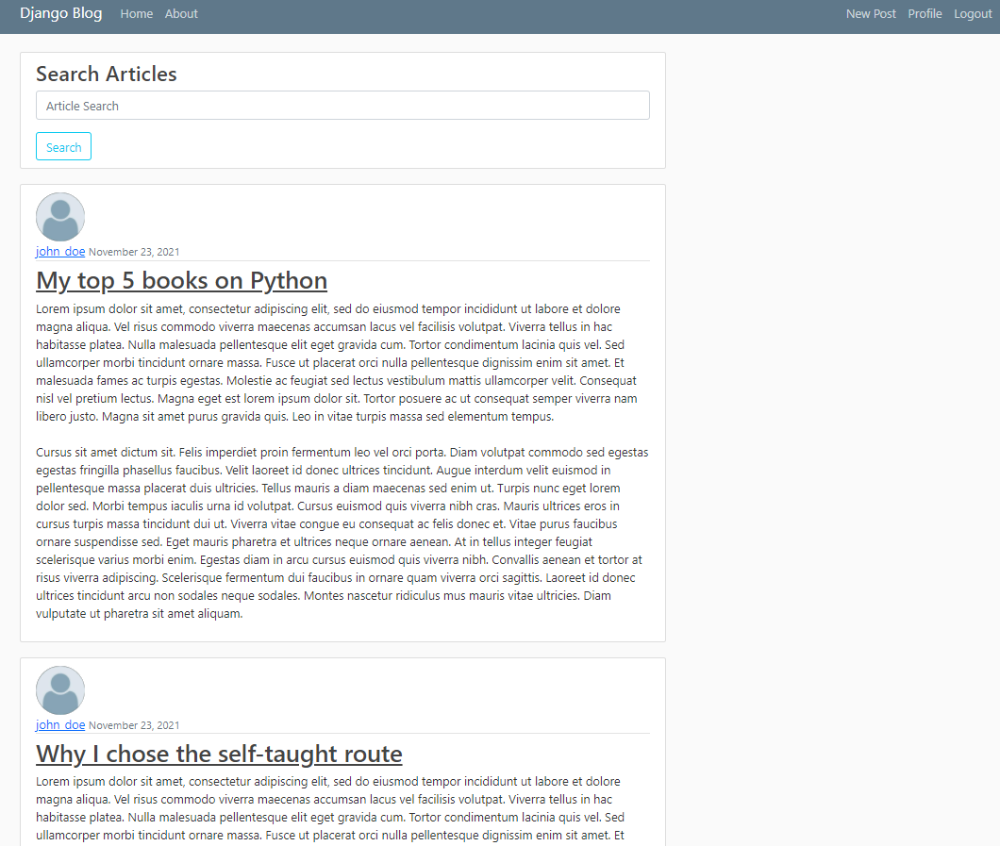
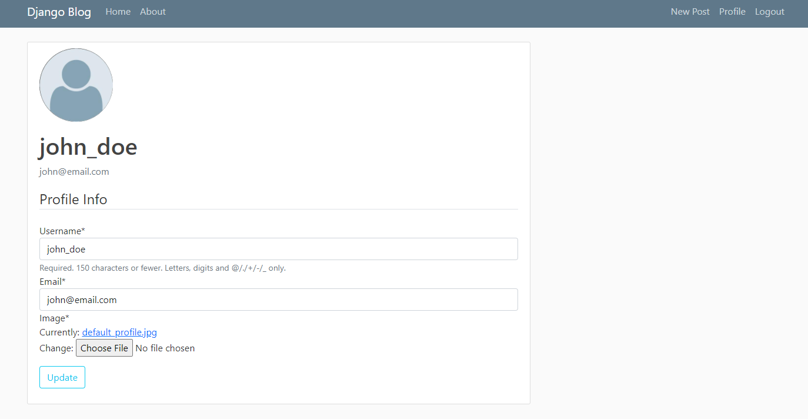
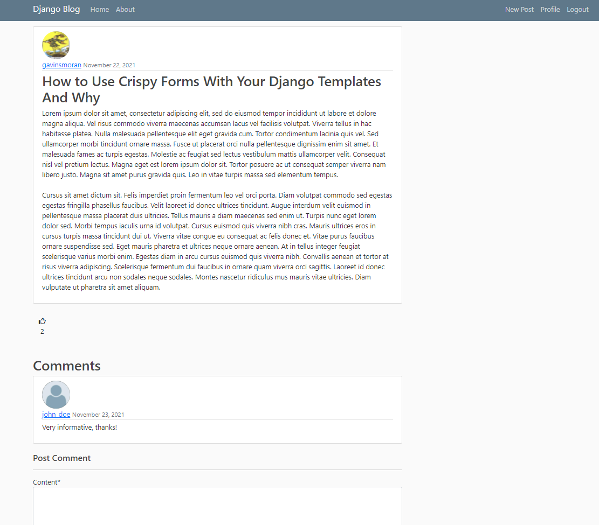

# Django Blog

## Overview
A fully functional blog application that features a variety of common blogging features. This application allows people to create accounts, make posts, comment and like other users posts, update/delete their own posts, search for posts, and edit their profiles. If a user forgets their password, it even has password recovery by email.

This project was originally a tutorial project that I modified. I added search, comment, and likes functionality to the base project. This project was my initial introduction into Django and served as a great resource for learning a variety of the tools django has to offer.

You can check it out here https://djangoblog-g.herokuapp.com/

Here you can see what the main page looks like. This page features all user's posts and paginates them after 7 posts.

Here is an image of a basic user profile, users are able to edit this information at will. Including the profile image.

Here you can see user comments and likes on another users post. 

